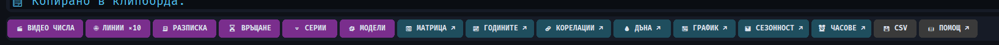

# 📜 Letopisets (Летописец)

**A market statistics console for people who distrust averages** — 8+ years of daily/weekly history for 13 assets (crypto + gold/DXY/S&P500/Russell), sliced into honest, falsifiable views. Built for a Bulgarian crypto YouTube channel whose whole brand is *"the headline lies, the close decides."*

*„Летописец" = chronicler. It remembers what price actually did.*



## The honesty rules (enforced in code, not in memory)

- Every average ships with its **median and sample size** — "August: mean −4.1%, median −11.5% (8 years, skewed by 2020's +58.8%)"
- A built-in **leave-one-out skew detector**: which single year moves the mean, and by how much
- Metrics that *cannot show a negative result* are considered lies and were removed after review (a "bounce %" that always came out positive; a frequency ladder that matched every week)
- No signals, no entries, no targets. Statistics only.

## Views

| View | What it answers |
|---|---|
| Scanner | day-by-day table: body %, streak ordinal, relative volume, % from yearly high, week context bands |
| 🎬 VIDEO NUMBERS | 200-week / 300-week SMA lines (TradingView convention), streak of closed weeks above/below, wick episodes counted honestly (adjacent ≤2 weeks = one episode) |
| 🧾 RECEIPT | monthly "receipt": what history says about *this* month, written to `receipts.json` **before** the month ends — provable, timestamped claims |
| ⏳ RECOVERY | after a ≥3/5/7/10/15% down day: median vs mean days to reclaim the close (the record: 2,747 days) |
| 🔻 STREAKS | after N consecutive red/green days, what the next day did — median ≈ 0, share ≈ 50%: streaks don't predict, and the tool says so |
| 💧 DRAWDOWNS | top drawdowns ≥5% with recovery times + underwater curve |
| 📅 MATRIX / YEARS | month×year heatmap; every year's path from Jan 1 overlaid with a median path |
| 🔗 CORRELATIONS | 90-day vs 1-year correlation heatmaps across all 13 assets |
| 📰 NEWS | reads the append-only headline archive written by [Radiotochka](../radiotochka) — "what was being said while price did that" |

Every chart exports a branded 1920×1080 PNG for video production. Dark/light themes. Telegram daily reports optional.

## Run

```bash
pip install customtkinter yfinance pandas numpy matplotlib requests
python price_data_tool.py
```

Windows packaging:

```bash
pyinstaller --onedir --windowed --name Letopisets --icon icon.ico ^
  --add-data "icon.ico;." --collect-all customtkinter price_data_tool.py
```

## License

MIT
